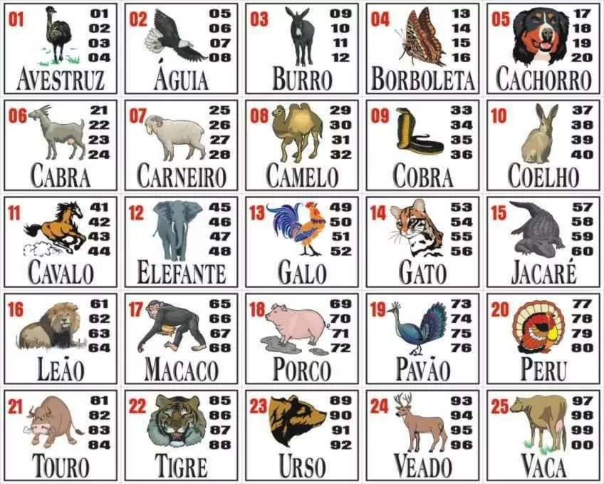

# web-2023.2

### Descrição
O projeto visa um web site para aposta no popularmente conhecido **jogo do bicho**, e também fornecer uma API no estilo *pokedex* com imagem, nome, grupo e números referentes ao animal. Na parte de apostas o cliente poderá apostar em modalidades e horários pré-definidos pelo sistema e administrador (pode ser uma definição automática ou manual)

### Como jogar no *Jogo do Bicho*
  1. Cliente escolhe em qual estado irá jogar
  2. Informa qual a hora do jogo (horários já definidos)
  3. Escolhe a modalidade do jogo (grupo, centena, milhar, mais detalhado a frente)
  4. Informa a númeração ou grupo, pode ser um ou mais número(s) e/ou grupo(s)
  5. Informa valor que vai jogar referente as escolhas acima
  6. Cliente pode adicionar mais informações do seu jogo repetindo os passos anteriores
  7. Por fim realiza o pagamento total do jogo e espera a sorte ao seu favor.

Na imagem acima os números vermelhos representam o grupo e os números pretos representam o final do número sorteado que determina o ganhador. 
Exemplo: foram sorteados os seguintes números
1. 5186
2. 5168
3. 8945
4. 8463
5. 7945

Para verificar qual **animal** foi sorteado pode-se utilizar a imagem e verificar com os números pretos o final de cada milhar, outra forma é utilizar a matemática, pegaremos a dezena da milhar e dividimos por **4**, caso sobre resto basta somar a 1, então teremos o **grupo** que vai de 1 a 25, e então saberemos qual animal foi sorteado, esse método é melhor para quem joga bastante, afinal, é mais fácil decorar 25 animais do que 4 números referentes ao animal.

Portanto no cálculo acima os animais sorteados foram:
1. Tigre
2. Macaco
3. Elefante
4. Leão
5. Elefante

Podemos observar que o *elefante* foi duas vezes sorteado, e isso é normal de acontecer, entretanto é necessário saber que dependendo do seu jogo você só ganhará uma vez ou até mesmo nenhuma, vamos entender sobre cada jogo que pode ser realizado usando os números e a sorte.

Temos várias opções que resultam em diferentes multiplicadores
- **Grupo**: você não joga no número, mas no animal, cada animal possui 4 números, logo possui quatro vezes mais chance de ganhar e por isso o retorno é menor. Nos exemplos acima você ganharia duas vezes.
- **Dezena**: os dois últimos números.
- **Centena**: mais díficil de acertar e por isso já possui retorno maior que o anterior.
- **Milhar**: são os 4 números que são sorteados, possui altíssimo retorno.

Ainda possui alguns jogos mais personalizados, como por exemplo:
- **Milhar invertida**: como o nome diz, pega a milhar sorteada, e inverte ela, exemplo: o primeiro prêmio na milhar invertida seria *8651 6815*
- **Centena invertida**: segue a mesma lógica da milhar, o resultado do primeiro prêmio seria: *651 815*
- **Dezena invertida**: o resultado do primeiro prêmio seria: *51 15*

E por diante, possui várias formas de jogar, além claro, dos locais, como por exemplo: *Rio de Janeiro, São Paulo, Goiás, Minas Gerais, Bahia, Paraíba e Ceará* são onde acontecem alguns jogos, vale resaltar que é somente o último em que o [jogo é legalizado](https://g1.globo.com/ce/ceara/noticia/2021/11/05/justica-do-ceara-autoriza-exploracao-do-jogo-do-bicho.ghtml)

### Funções
- Criar e acessar conta
- Pagar aposta via PIX (única forma de pagamento, por enquanto)
- Apostar
- Verificar aposta

<!-- ### Rotas
#### Da aplicação
#### Da API -->

### Fontes
<!--  -->
- [Fonte 1: Jogo do bicho](http://basilio.fundaj.gov.br/pesquisaescolar/index.php?option=com_content&id=387)
- [Fonte 2: Tabela do jogo do bicho](http://basilio.fundaj.gov.br/pesquisaescolar/index.php?option=com_content&id=387)